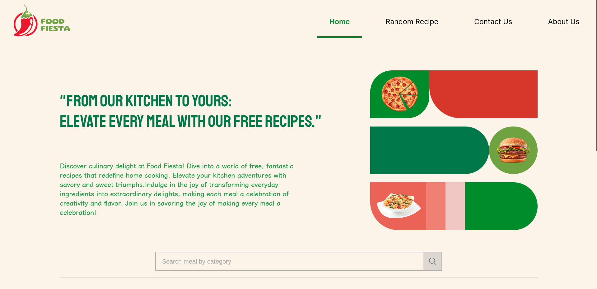
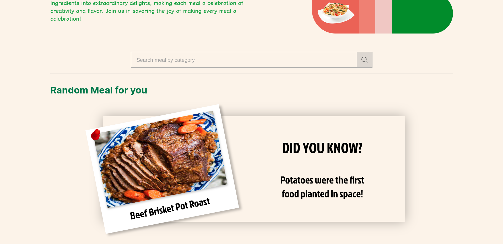
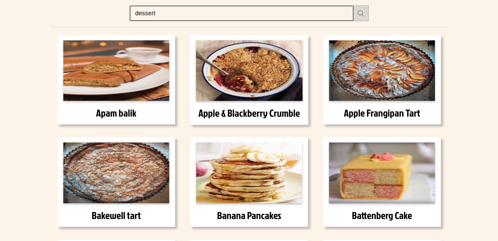
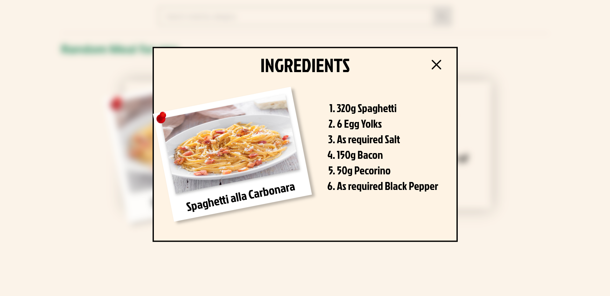
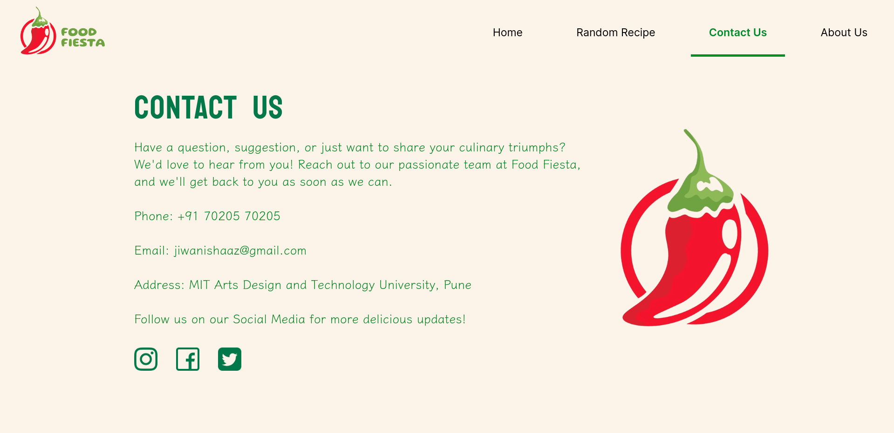
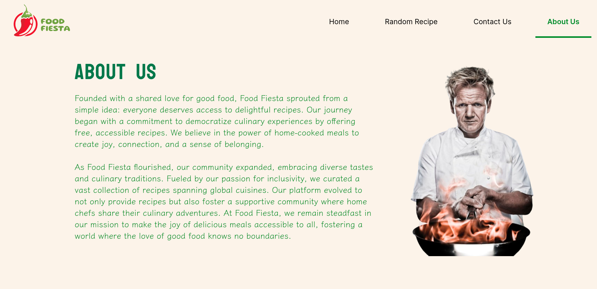

# Food Fiesta

Welcome to Food Fiesta, your ultimate destination for discovering and exploring a wide variety of delicious food items categorized for your convenience. This website is designed to provide a seamless experience for users to browse and discover mouthwatering dishes from different categories, all powered by a robust API that fetches real-time information.

## Introduction

Food Fiesta is a web application that leverages an external API to fetch information about various food items and present them in an organized manner based on categories. Whether you're a food enthusiast, a chef, or just looking for culinary inspiration, Food Fiesta has something for everyone.

## Features

- Random Meal: Couldnt think of what to make? here we have a random Recipe on every reload. No worries to worry about what to make.

- Ingredients: Inredients for the random Meal are just a click away and you can even see the measures or the quantity of ingredients you need in order to make a tasty dish.

- Category-based Navigation: Explore a diverse range of food items conveniently categorized for easy navigation.

- Real-time Updates: The website fetches data from an API, ensuring that you get the latest and most accurate information.

- Responsive Design: Enjoy a seamless experience on any device – desktop, tablet, or mobile.

- Search Functionality: Find specific dishes or ingredients with the powerful search feature.

- User-Friendly Interface: Intuitive design for a hassle-free and enjoyable browsing experience.

## Links

- Github Repo Link: https://github.com/shaaaaz/Food-Fiesta

- Netlify Depolyed Link: https://food-fiesta-by-shaaz.netlify.app

- Figma (Desktop Version):https://www.figma.com/file/37gfJJ7EPsbJhzQw2eZaVq/Food-Fiesta-(Desktop-Version)-by-Shaaz-Jiwani?type=design&node-id=0%3A1&mode=design&t=XOlUIFfHZE1z3K04-1

- Figma (Mobile Version): https://www.figma.com/file/mbetyVy5aKoeKD5VZTKLCM/Food-Fiesta-(Mobile-Version)-by-Shaaz-Jiwani?type=design&node-id=0%3A1&mode=design&t=L4EHzsOb79gekaQs-1

## Screenshots

## Bibliography

- Icons - (https://www.flaticon.com/)

- Icons - (https://www.shutterstock.com/)

- API - MealDB (https://www.themealdb.com/api.php)

- Technical Help - W3 Schools (https://www.w3schools.com/)

- Technical Help - Stack Overflow (https://stackoverflow.com/)

- Technical Help - MDN Web Resources (https://developer.mozilla.org/en-US/)

- Theme and colours- Coloors (https://coolors.co/)

- Design - Figma (https://www.figma.com/)

